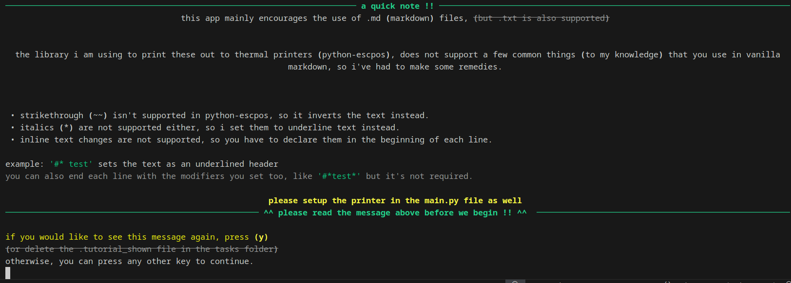

# Paranoia Task Reciever

hello !! this is a side project i made in my spare time for a paranoia ttrpg i am running, so things may be a bit janky.

a lot of the game requires giving players tasks and passing notes to each other. this uses an esc-pos compatable printer to accomplish this with given .md files for some style/flare to my campaign (and it's also a timesaver for me not having to handwrite them manually.)

# Installation
1. clone the git repo: `(jj) git clone https://github.com/stel1a/Paranoia-Task-Reciever`
2. `cd Paranoia-Task-Reciever`
3. `pip install .` (create a python venv first if you need to)
4.  start the script by running `paranoia` in the terminal :3c.

(if the printer isn't being detected, try adding usbutils on windows, and changing udev rules on *NIX devices, example below)

`SUBSYSTEM=="usb", ATTRS{idVendor}=="04b8", ATTRS{idProduct}=="0202", MODE="0666", GROUP="uucp"`
(get the vendor id and product from lsusb, and if you don't have uucp as a valid group, try dialout instead !!)

# Dependencies
* python-escpos (python-escpos[all])
* python-rich (tui)
* readchar

an example.md file is given in the source code as an example of how formatting works (of which you can print out for yourself if you run the script in the repository directory), and a tutorial is given on startup which guides ya through the basics. here is a screenshot of that!

have fun !! :3c
